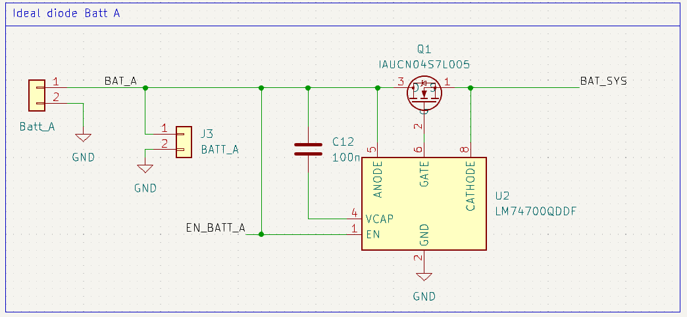
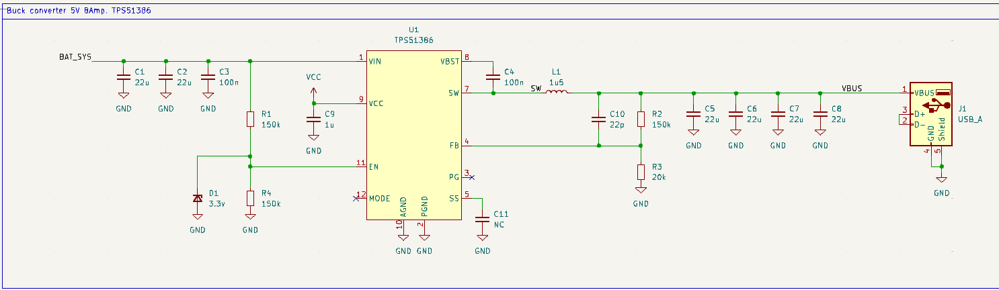
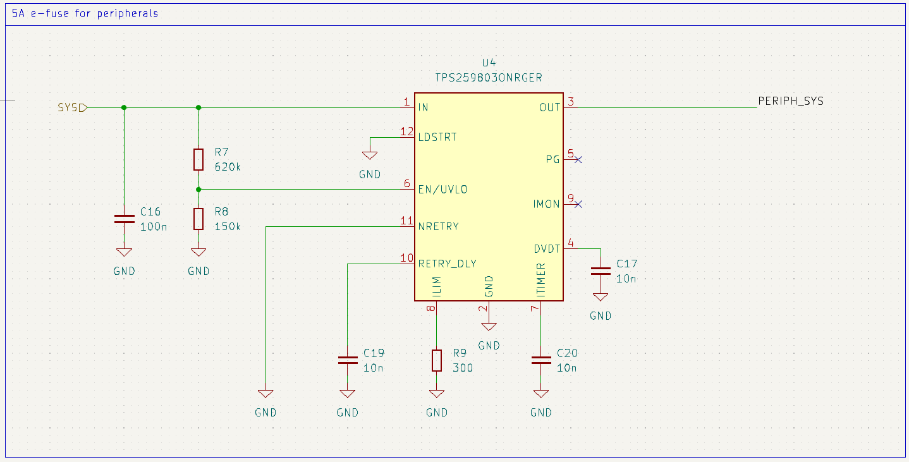
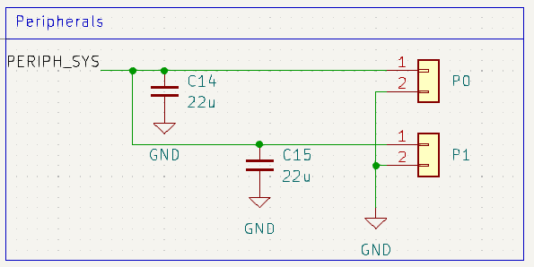
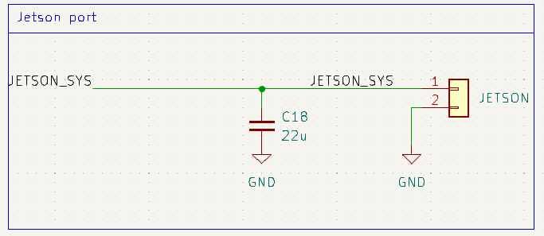

# F1Tenth power board

This repository contains the power board design for a F1Tenth car.

Designed on Kicad 8.0.3.

## History
This project was originally launched in the summer of 2024 at [CTU](https://www.cvut.cz/en), thanks to David Zahrádka, to facilitate easier experimentation for researchers.

## Features

This board is designed to power all F1tenth components. Two 3S Li-Po batteries power the board. Those batteries are connected in parallel throught an ORing circuitry. This allow to hot swap batteries. The output of the ORing is named `BATT_SYS` and is directly connected to VESC output **without protections**.

The `Jetson` terminals is also connected to `BATT_SYS` but protected by a dedicated 5A e-fuse. The `P_0` and `P_1` terminals are connected to `BATT_SYS` through another e-fuse and can draw up to 5A.

A 5V 6A buck converter provide power to the `USB A` connector. This output is protected for overcurrent up to 6A.

## SAFETY WARNING

Li-Po can provide **huge amount** of current. **Be careful** when handling the board. **Do not short circuit** the batteries and VESC output as they are not protected. Do not exceed the maximum input voltage: **20V**.

PCB can be hot when drawing high current. 

## Absolute maximum ratings
| | Min | Max | Unit
--- | --- | --- | ---
Battery voltage | 6 | 20 | V
Jetson current |  | 5 | A
P0 + P1 current |  | 5 | A
USB current |  | 6 | A
VESC current |  | 60 | A

## File structure

- [power_board.pro](power_board_f1tenth.kicad_pro) - Kicad project file
- [power_board.sch](power_board_f1tenth.kicad_sch) - Schematic
- [power_board.kicad_pcb](power_board_f1tenth.kicad_pcb) - PCB layout
- [symbol/](symbol/) - Custom symbols
- [power_board.pretty/](symbol/) - Custom footprints

## DRC

Design rules checks comply with JLCPCB capabilities.

## Circuit

### Ideal diode

Ideal diode behavior is achieved by LM74700 and the high power N channel MOSFET IAUCN04S7L005.

The `J3` can be used to connect a battery life indicator.

Circuit for battery B is identical.

     

### Buck converter

Provide 5V 6A to the USB connector. Data p and n are tied together as the USB connector is only used for power, it helps to trigger high current mode on some device.

TPS51386 also provide overcurrent protection, under and overvoltage protection.

     

### E-fuse

Those e-fuse are used to protect the Jetson and the peripherals. The TPS25980 is configured to limit the current to 5A. It allow overcurrrent for 2ms to allow inrush current. Number of retry is unlimited and rise time is 1ms.

    

### Terminals

Terminal are bornier-2_P5.08mm. They are used to connect the peripherals and the Jetson. They are from the MSTB series from Phoenix Contact. They can be easily unpluged and pluged.

    
    

## BOM
Designator | Footprint | Quantity | Value
--- | --- | --- | ---
C1, C14, C15, C18, C2, C5, C6, C7, C8 | 0805 | 9 | 22u
C10 | 0805 | 1 | 22p
C11 | 0805 | 1 | NC
C12, C13, C16, C21, C3, C4 | 0805 | 6 | 100n
C17, C19, C20, C22, C23, C24 | 0805 | 6 | 10n
C9 | 0805 | 1 | 1u
D1 | SOT96P237X111-3N | 1 | 3.3v
D2, D3, D4, D5 | 0805 | 4 | LED
J1 | USB_A_Molex_67643_Horizontal | 1 | USB_A
J7 | TerminalBlock_bornier-2_P5.08mm | 1 | P0
J8 | TerminalBlock_bornier-2_P5.08mm | 1 | P1
J9 | TerminalBlock_bornier-2_P5.08mm | 1 | JETSON
L1 | SRP12701R5M | 1 | 1u5
Q1, Q2 | IAUCN04S7L005 | 2 | IAUCN04S7L005
R1, R13, R2, R4, R8 | 0805 | 5 | 150k
R10, R11, R5, R6 | 0805 | 4 | 1k
R12, R7 | 0805 | 2 | 620k
R14, R9 | 0805 | 2 | 300
R3 | 0805 | 1 | 20k
U1 | RJN_Package_12-Pin_VQFN-HR | 1 | TPS51386
U2, U3 | SOT65P280X110-8N | 2 | LM74700QDDF*
U4, U5 | TPS259803ONRGER | 2 | TPS259803ONRGER

Warning: *LM74700 exist in different packages. The one used in this design is the 8 pin LM74700D.

## Prices *(Updated on August 18, 2024)*

Example prices on Mouser and JLCPCB.

Shipping is not included.

JLCPCB prices for 5 boards: 1,83 € = 46CZK

Mouser price for 1 board: 28,53 € = 723CZK

Total: **30,36 € = 769CZK** 

*This board costs half the price of the original [F1tenth power board](https://f1tenth.readthedocs.io/en/foxy_test/getting_started/build_car/bom.html)...*

| ID Mouser | ID de fab. | Fabricant | ID client | Description | Qté. | Prix (EUR) | Ext. : (EUR) |
| --- | --- | --- | --- | --- | --- | --- | --- |
| 595-TPS51386RJNR | TPS51386RJNR | Texas Instruments | | 4.5-V to 24-V input, 8-A synchronous buck converter 12-VQFN-HR -40 to 125 | 1 | 0,967 € | 0,97 € |
| 726-IAUCN04S7L005ATM | IAUCN04S7L005ATMA1 | Infineon | | MOSFET N | 2 | 2,48 € | 4,96 € |
| 595-LM74700QDDFRQ1 | LM74700QDDFRQ1 | Texas Instruments | | 3.2-V to 65-V, 80-uA IQ automotive ideal diode controller 8-SOT-23-THIN -40 to 125 | 2 | 1,66 € | 3,32 € |
| 187-CL21A226MAYNNNE | CL21A226MAYNNNE | Samsung Electro-Mechanics | | MLCC - CMS 22uF+/-20% 25V X5R 2 0805 | 10 | 0,106 € | 1,06 € |
| 71-CRCW0805J-20K-E3 | CRCW080520K0JNEA | Vishay | | CMS 1/8watt 20Kohms 5% 200ppm | 10 | 0,02 € | 0,20 € |
| 187-CL21B104KBFNNNE | CL21B104KBFNNNE | Samsung Electro-Mechanics | | MLCC - CMS 100n SAMSUNG | 10 | 0,019 € | 0,19 € |
| 187-CL21B105MBFNNNE | CL21B105MBFNNNE | Samsung Electro-Mechanics | | MLCC - CMS X7R, 1uF, +/-20%, 50v, 0805 | 10 | 0,025 € | 0,25 € |
| 863-BZX84C3V9LT1G | BZX84C3V9LT1G | onsemi | | Zener 3.9V 250mW | 1 | 0,093 € | 0,09 € |
| 652-SRP1270-1R5M | SRP1270-1R5M | Bourns | | CMS 1.5uH 20% SMD 1270 | 1 | 0,911 € | 0,91 € |
| 640-USB1130-15-A | USB1130-15-A | Global Connector Technology (GCT) | | USB A 2.0 Skt RA High Life 15u" T Hole W/Shell Stake T & R | 1 | 0,735 € | 0,74 € |
| 595-TPS259803ONRGER | TPS259803ONRGER | Texas Instruments | | Hotswap controller 2.7-V to 24-V, 8-A, 3-mohm smart eFuse 24-VQFN -40 to 125 | 2 | 1,43 € | 2,86 € |
| 77-VJ0805A220JXACBC | VJ0805A220JXACW1BC | Vishay | | MLCC - CMS 0805 22pF 50volts C0G 5% | 10 | 0,052 € | 0,52 € |
| 71-CRCW0805-150K-E3 | CRCW0805150KFKEA | Vishay | | CMS 1/8watt 150Kohms 1% 100ppm | 10 | 0,023 € | 0,23 € |
| 187-CL21C103JBFNNNE | CL21C103JBFNNNE | Samsung Electro-Mechanics | |  MLCC - CMS 10nF+/-5% 50V C0G 20 0805 | 10 | 0,105 € | 1,05 € |
| 71-CRCW0805620KFKEA | CRCW0805620KFKEA | Vishay | | CMS 1/8watt 620Kohms 1% | 10 | 0,031 € | 0,31 € |
| 71-CRCW0805300RFKEA | CRCW0805300RFKEA | Vishay | | CMS 1/8watt 300ohms 1% | 10 | 0,023 € | 0,23 € |
| 71-CRCW08051K00JNEAC | CRCW08051K00JNEAC | Vishay | | CMS 1/8Watt 1Kohms 5% Commercial Use | 10 | 0,019 € | 0,19 € |
| 710-150080VS75000 | 150080VS75000 | Wurth Elektronik | | LED CMS WL-SMCW SMDMono TpVw Waterclr 0805 BrtGrn | 5 | 0,177 € | 0,89 € |
| 651-1752492 | 1752492 | Phoenix Contact | | Female bornier MSTBA 2,5 HC/ 2-GU | 3 | 0,465 € | 1,40 € |
| 651-1892398 | 1892398 | Phoenix Contact | | Male bornier MSTB 2,5/ 2-ST- 5,08 BD:NZ KEG | 6 | 1,36 € | 8,16 € |

## Additionals notes

- Copper thickness:
    2oz is recommended as batteries can provide high current. But 1oz can be sufficient for the F1tenth car, as it is not used at full power.